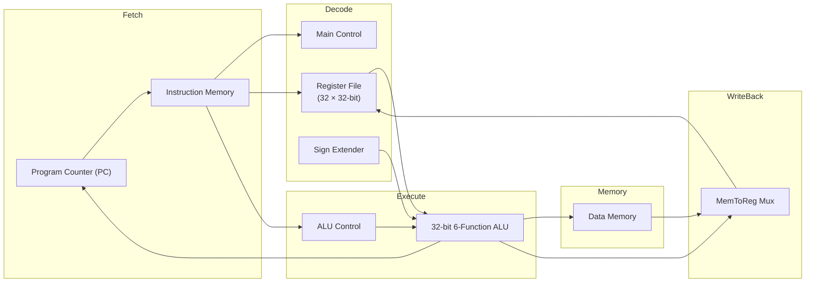

<div align="center">

# 32-bit Single-Cycle CPU with Control Unit

**A MIPS-inspired processor datapath designed and simulated in Logisim**

[](https://github.com/Saidul00005/32-bit-Single-cycle-CPU-with-control-unit)
[](http://www.cburch.com/logisim/)
[](https://github.com/Saidul00005/32-bit-Single-cycle-CPU-with-control-unit)
[](https://www.northsouth.edu/)
[](https://github.com/Saidul00005)

**North South University, Dhaka, Bangladesh**

_Computer Organization & Architecture project — from ripple-carry ALU blocks to a complete single-cycle datapath with main and ALU control units._

</div>

---

## Overview

This repository contains a **32-bit single-cycle CPU** implementation built entirely in [Logisim](http://www.cburch.com/logisim/). The design follows a classic **MIPS-style datapath** and was developed as a two-part academic project at **North South University, Dhaka, Bangladesh**:

|    Part    | Focus                                                                      |
| :--------: | -------------------------------------------------------------------------- |
| **Part 1** | Hierarchical ALU design and arithmetic building blocks                     |
| **Part 2** | Full single-cycle datapath with **Main Control** and **ALU Control** units |

Every major component — from a 2-bit ALU slice to the complete processor — is implemented as a reusable sub-circuit, making the design modular, inspectable, and easy to simulate step by step.

---

## Architecture



In a **single clock cycle**, the processor completes instruction fetch, decode, execute, memory access, and write-back — controlled by signals generated from the instruction **opcode** and **function** fields.

---

## Features

### Processor Core

- **32-bit single-cycle datapath** with Program Counter, instruction fetch, and write-back path
- **32-register file** using standard MIPS register naming (`$zero`, `$at`, `$v0`–`$v1`, `$a0`–`$a3`, `$t0`–`$t9`, `$s0`–`$s7`, `$k0`–`$k1`, `$gp`, `$sp`, `$fp`, `$ra`)
- **Instruction & data memory** interfaces for load/store and arithmetic operations
- **Branch support** with zero-flag comparison logic

### Control System

| Signal             | Purpose                                          |
| ------------------ | ------------------------------------------------ |
| `RegWrite`         | Enable writing to the destination register       |
| `MemRead`          | Read from data memory                            |
| `MemWrite`         | Write to data memory                             |
| `Branch`           | Conditional branch when ALU result is zero       |
| `MemtoReg`         | Select memory data vs. ALU result for write-back |
| `ALUSrc`           | Select register operand vs. immediate            |
| `ALUOp0`, `ALUOp1` | Main control inputs to ALU control logic         |

The **ALU Control** unit maps opcode/function inputs to ALU operation select lines.

### ALU & Arithmetic Units

Built bottom-up using a hierarchical design strategy:

```
2-bit ALU  →  4-bit ALU  →  8-bit ALU  →  16-bit ALU  →  32-bit ALU
                                                              ↓
                                              32-bit 6-Function ALU
                                                              ↓
                                    4-bit × 4-bit  →  16-bit × 16-bit Multiplier
```

The **32-bit 6-Function ALU** integrates:

- Ripple-carry addition / subtraction (via invert + carry-in)
- Bitwise AND and OR
- Set-on-less-than (SLT)
- 16-bit × 16-bit multiplication
- Zero flag output for branch decisions

### Sample Instructions

The datapath includes annotated MIPS-style examples:

| Operation  | MIPS Code           | Machine Code                            |
| ---------- | ------------------- | --------------------------------------- |
| Add        | `add $t3, $t1, $t2` | `000000 01001 01010 01011 00000 100000` |
| Store Word | `sw $t0, 0($t1)`    | `101011 01001 01000 00000 00000 000000` |

---

## Project Structure

```
32-bit-Single-cycle-CPU-with-control-unit/
│
├── CSE332.9-1421353042-Md. Sayadul Haque-Project Part 1 Report.pdf
├── CSE332.9-1421353042-Md. Sayadul Haque-Project Part 2 Report-32 bits Single cycle CPU with Control.pdf
├── CSE332.9-1421353042-Md. Sayadul Haque-Project Part 2-32-bit Single cycle CPU with control.circ
└── README.md
```

### Logisim Circuits

Open the `.circ` file in Logisim to explore these sub-circuits:

| Circuit                                | Description                                             |
| -------------------------------------- | ------------------------------------------------------- |
| `2-bit ALU` → `32-bit ALU`             | Scalable ripple-carry ALU hierarchy                     |
| `4 Bit by 4 Bit Multiplication Unit`   | Building block for unsigned multiplication              |
| `16 bit by 16 bit Multiplication Unit` | Extended multiplier used by the main ALU                |
| `32-bit 6 functions ALU`               | Full ALU with arithmetic, logic, SLT, and multiply      |
| `ALU Control`                          | Decodes function/ALUOp signals for ALU operation select |
| `32-bit register`                      | 32-entry register file with dual read ports             |
| `Main Control`                         | Opcode decoder generating all datapath control signals  |
| `Single Cycle Datapath`                | Complete processor — start here for simulation          |

---

## Getting Started

### Prerequisites

- [Logisim](http://www.cburch.com/logisim/) **2.7.1** (the version used to build this project)
- Java Runtime Environment (JRE) compatible with Logisim

### Run the Simulation

1. **Clone** this repository:

   ```bash
   git clone https://github.com/Saidul00005/32-bit-Single-cycle-CPU-with-control-unit.git
   cd 32-bit-Single-cycle-CPU-with-control-unit
   ```

2. **Open** the Logisim circuit file:

   ```
   CSE332.9-1421353042-Md. Sayadul Haque-Project Part 2-32-bit Single cycle CPU with control.circ
   ```

3. **Navigate** to the `Single Cycle Datapath` circuit from the project explorer.

4. **Simulate** using Logisim's tick/clock controls:
   - Use **Clear** to reset registers and memory
   - Toggle **Write on RD** after executing an instruction to commit register writes
   - Enter function codes (e.g. `000001` for ADD) as indicated on-circuit
   - Step the clock to observe fetch → execute → write-back

5. **Explore** individual sub-circuits (ALU, control units, register file) to understand each stage in isolation.

---

## Design Highlights

- **Bottom-up ALU construction** — demonstrates how small arithmetic blocks compose into a full 32-bit execution unit
- **Dedicated control units** — separates main decode logic from ALU-specific function decoding
- **MIPS-compatible register map** — uses industry-standard register names for clarity
- **Fully visual simulation** — every wire, mux, and control signal is visible and editable in Logisim
- **Documented test cases** — sample MIPS instructions with binary and hex machine code on the datapath

---

## Documentation

Detailed design explanations, truth tables, timing analysis, and simulation results are available in the project reports:

| Report                                                                                                                                               | Contents                                                |
| ---------------------------------------------------------------------------------------------------------------------------------------------------- | ------------------------------------------------------- |
| [Part 1 Report (PDF)](./CSE332.9-1421353042-Md.%20Sayadul%20Haque-Project%20Part%201%20Report.pdf)                                                   | ALU hierarchy and arithmetic unit design                |
| [Part 2 Report (PDF)](./CSE332.9-1421353042-Md.%20Sayadul%20Haque-Project%20Part%202%20Report-32%20bits%20Single%20cycle%20CPU%20with%20Control.pdf) | Single-cycle datapath, control unit design, and testing |

---

## Author

**Md. Sayadul Haque**  
**North South University, Dhaka, Bangladesh**  
Course: **CSE332.9** — Computer Organization & Architecture

---

## Acknowledgments

This project was developed as part of the CSE332.9 curriculum at **North South University, Dhaka, Bangladesh**. The design is inspired by the classic MIPS single-cycle processor architecture commonly taught in computer organization courses.

---

<div align="center">

_If this project helped you understand CPU design, consider giving it a star._

</div>
